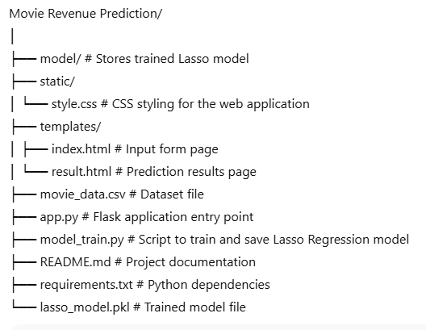
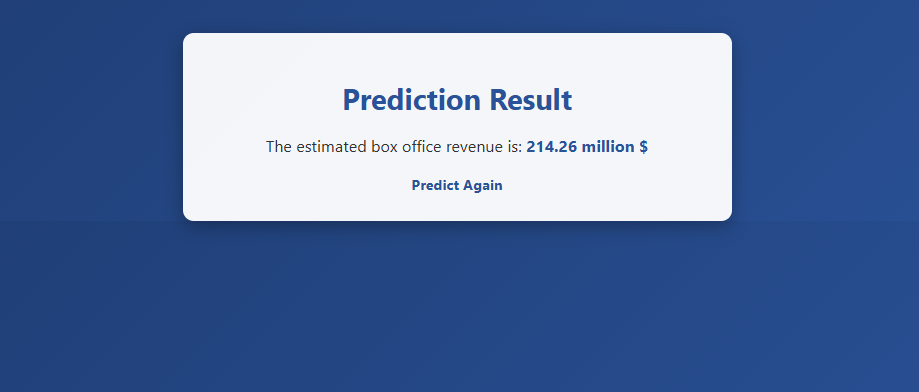

# Movie Revenue Prediction Before Release (Lasso Regression)

A **Flask-based Machine Learning web application** that predicts the expected box office revenue of a movie **before its release**.  
The prediction is based on pre-release factors such as budget, cast popularity, director success rate, trailer views, and more.  
The model is powered by **Lasso Regression** for feature selection and accurate prediction.

---

### Overview
This project allows users to input movie details before its release and receive a predicted revenue.  
It is designed to help production companies, marketers, and analysts estimate box office performance.

---

### Features
- Predicts movie revenue before release  
- Uses **Lasso Regression** with L1 regularization for feature selection  
- Accepts multiple movie-related input parameters  
- Responsive **HTML/CSS frontend**  
- Flask-powered backend for real-time prediction  

---

### Tech Stack
- **Python 3.x**  
- **Flask**  
- **scikit-learn**  
- **pandas**, **numpy**  
- **HTML/CSS**  

---

### Project Structure

---

### Installation & Setup

#### 1. Clone the Repository

git clone https://github.com/kesavika-abi/movie-revenue-prediction.git
cd movie-revenue-prediction

#### 2. Install Dependencies

pip install -r requirements.txt

#### 3. Train the Model

python model_train.py
This will create and save the trained model file (lasso_model.pkl) inside the model directory.

#### 4. Run the Web App

python app.py
Open in your browser:

http://127.0.0.1:5000/

### Use Cases
- Predicting box office performance before release

- Helping marketing teams optimize budgets

- Demonstrating Lasso Regression in real-world applications

### Future Enhancements
- Integrate with a movie database API for automatic input fields

- Allow comparison between multiple regression models

- Deploy online via Heroku, Render, or similar platforms

## Screenshots

## Input Page

## Result Page

